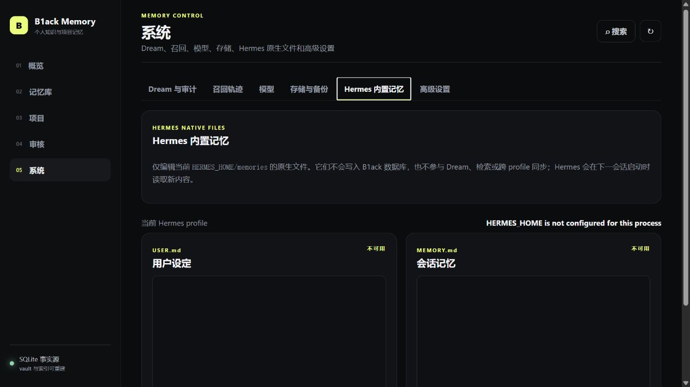
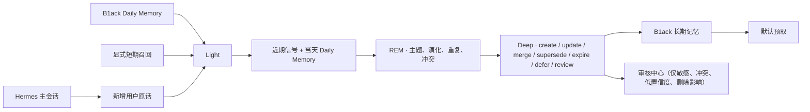

<div align="center">
  <h1>B1ack Memory</h1>
  <p><strong>让 Hermes 拥有可观察、可修正、真正属于你的长期记忆。</strong></p>
  <p>个人级 · local-first · 白盒化 Dream · 低成本模型兼容 · 单人可维护</p>

  <p>
    <a href="https://github.com/B1ackHand666/B1ack-Memory/releases/latest"></a>
    
    
    
  </p>

  <p>
    <a href="#快速开始">快速开始</a> ·
    <a href="#记忆如何形成">工作方式</a> ·
    <a href="#记忆演化">记忆演化</a> ·
    <a href="#数据与安全">数据安全</a> ·
    <a href="CHANGELOG.md">更新日志</a>
  </p>
</div>

> **v0.6.0：独立 Dream 核心版。** B1ack 改为“近期记忆 → Light → REM → Deep → 长期记忆”的低噪音机制；Hermes 原生 `USER.md` / `MEMORY.md` 与 B1ack SQLite 完全独立，不再导入、投影或同步。

## v0.6.0 的五个工作区

- **概览**：当天 Daily Memory、活跃近期信号、REM/Deep 最近结果、需要决定事项和存储健康。
- **记忆库**：长期记忆、近期信号、Daily Memory 与冻结的 v0.5 候选历史；近期层显示来源、强化次数和到期时间。
- **项目**：保留项目摘要、确认工作项和上下文预览，并展示可靠归属的项目 Daily Memory、近期信号和 REM 主题。
- **审核**：只聚焦敏感、低置信度、真实冲突和“证据受影响”；普通同义重复在 Light/Deep 静默收敛。
- **系统**：Dream 状态、近期层保留期、日志、模型、存储与备份；新增当前 Hermes profile 的原生记忆安全编辑页。

### 从 v0.5.x 升级

schema v7 数据库会在迁移前创建 `backups/*-pre-schema-v8.db` 在线备份，再向前迁移至 schema v8。现有长期记忆、版本、证据、事件、项目、主题、摘要和备份均保持；旧候选统一标记为 `legacy_history`，可浏览、导出和隐私删除，但不再进入 Dream、默认召回或新审核队列。无需手工重建数据库。

Hermes 的 `USER.md` / `MEMORY.md` 不会导入 B1ack，也不会被 B1ack 重写。系统页的“Hermes 内置记忆”只允许编辑当前 `HERMES_HOME/memories/USER.md` 与 `MEMORY.md`，并在保存时检测外部修改冲突。它们会在 Hermes 的下一会话启动时读取，绝不影响 B1ack 的数据库、Dream、检索或其他 profile。

备份现在是带 manifest 和 SHA-256 校验的 ZIP 整包，默认不包含 API Key。恢复必须先通过归档、SQLite 和 schema 校验并展示差异，执行前还会自动备份当前状态；执行时先在同目录 `.restore.tmp` 完成迁移和 fsync，再原子替换事实库。高于当前实现的 schema 会被拒绝，仍有迁移路径的旧 schema 可直接恢复。

<p align="center">
  
</p>
<p align="center"><sub>Hermes 原生文件可在当前 profile 中安全编辑，同时与 B1ack 的 Dream 和数据库严格隔离。</sub></p>

## 为什么选择 B1ack Memory

| 本地优先 | 记忆白盒化 | 低成本模型 |
| :--- | :--- | :--- |
| SQLite 单文件是唯一事实源，不需要外部数据库或云端记忆服务。 | 从原始证据、近期层、REM 反思到 Deep 整理，完整展示记忆演化路径。 | 支持 DeepSeek、OpenAI、Ollama、LM Studio 等 OpenAI-compatible 服务。 |
| **自动治理** | **隐私可控** | **单人可维护** |
| Light 收敛、REM 反思、Deep 整合与定向审核，阻止噪声、重复与冲突进入长期池。 | 支持回收、恢复和关联数据硬删除；密钥不在 WebUI 中回显。 | 无 ORM、无 Node 构建链、无新增常驻服务，主要维护都能在 WebUI 完成。 |

B1ack Memory 在 Hermes 回答前只召回相关的有效长期记忆、可靠项目的确认摘要和确认工作项。近期信号、Daily Memory、原始会话、冻结候选和未确认项目状态均不参与默认注入；明确搜索近期信号只会弱强化其近期排序，不会单独构成长期晋升依据。全文检索开箱即用；embeddings 只是可选增强，即使向量服务不可用也能继续工作。

## 快速开始

要求 Hermes Agent 0.20.0+、Python 3.11+。生产环境请使用 Hermes 插件安装器，单独安装 wheel 不会让 Hermes 0.20.x 自动发现 Memory Provider。

### 1 · 安装插件

```bash
hermes plugins install B1ackHand666/B1ack-Memory --enable
```

### 2 · 选择记忆 Provider

```bash
hermes memory setup
```

在交互界面中选择 `b1ack-memory`。

### 3 · 重启 Hermes

```bash
hermes gateway restart
```

Dashboard 已启用时，重新启动 Dashboard 进程以加载新版插件页面：

```bash
hermes dashboard --no-open
```

### 4 · 验证状态

```bash
hermes memory status
hermes b1ack-memory status
```

### 升级现有安装

升级前先创建一份记忆备份，再更新插件并重启网关：

```bash
hermes b1ack-memory backup
hermes plugins update b1ack-memory
hermes gateway restart
```

如果插件目录不是通过 Git 安装的，使用强制安装更新：

```bash
hermes plugins install B1ackHand666/B1ack-Memory --enable --force
hermes gateway restart
```

升级到 v0.6.0 后，先在系统页确认 `近期信号 14 天` 与 `Daily Memory 30 天` 的默认保留期是否符合需求；旧候选在“v0.5 历史”中保留，不需要也不应该重新进入 Dream。

## 打开个人记忆控制台

Hermes Dashboard 中会出现 **B1ack Memory** 标签。也可以启动更轻量的独立 WebUI：

```bash
hermes b1ack-memory ui --host 127.0.0.1 --port 7788 --no-open
```

独立页面地址为 `http://127.0.0.1:7788/api/ui/`。服务器上建议保持 loopback 监听，再通过 SSH 端口转发访问，不要直接暴露到公网。

首次打开后：

1. 在“模型与设置”中填写兼容地址、模型名和 API Key，并测试连接。
2. 在“时间与日期”中一键采用浏览器检测的 IANA 时区，再设置每日 Dream 时间。
3. 保持 embeddings 关闭即可使用中英文全文检索；需要时再单独启用向量增强。
4. 在“备份与维护”创建第一份手动备份。

## 记忆如何形成



- **Light** 只处理新增或变化输入，输出 `discard / reinforce / merge / revise / create_signal`。普通重复会收敛到一个近期信号，不再制造候选或项目工作项。
- **Daily Memory** 是近期池的一部分：每个日期有一份全局内容，可靠归属的项目可有同日分区；它不是长期记忆，也不是候选队列。
- **REM** 读取活跃近期信号及最近 30 天 Daily Memory，只形成可追溯反思，不写长期记忆；来源敏感标记会随反思保留。
- **Deep** 仅处理由 REM 支持且已有两个不同本地日期近期证据的结论，原子执行 `create / update / merge / supersede / expire / defer / review`；优先修改已有长期记忆。敏感 Signal、关联敏感 Signal 的 Daily Memory 或无法确认来源的反思始终进入审核，即使模型返回非敏感也不能绕过。
- **Recall** 默认预取在检索层强制排除近期层、原始会话和历史候选；显式短期搜索只提供弱强化，不能单独触发长期晋升。

## v0.5 历史与兼容记录

v0.5 的候选、准入决定和旧审核项迁移为只读历史：可浏览、查看血缘、导出和执行隐私永久删除，但不会进入新的 Dream、默认召回或默认审核队列。既有 `origin=hermes-builtin` 也只作为历史标签保留。

在 v0.6 的记忆库中，日常维护应使用“长期记忆 / 近期信号 / Daily Memory / v0.5 历史”四个分区。审核中心只显示敏感、真实冲突、低置信度、Deep 需要决定和“证据受影响”事项；普通同义重复由 Light 或 Deep 静默合并。

近期信号默认保留 14 天，Daily Memory 默认保留 30 天。删除近期层会立刻停止其参与 Light、REM、Deep 与检索；永久删除按级联策略同步清理 `recent_evidence` 关联的 Signal、Daily Memory、raw turn、REM 反思、work item、准入决定、摘要来源、投影任务、模型调用、召回和索引。共享 raw turn 只有在没有剩余有效引用时才删除；若长期记忆因此失去唯一或关键证据，系统会创建可见的 evidence-impact 审核项而不会静默移除该长期记忆。

## 数据与安全

默认数据目录是 `~/.hermes/b1ack-memory`，同一操作系统用户下的 Hermes profiles 共用；也可以通过 `B1ACK_MEMORY_HOME` 显式覆盖。

| 文件 | 用途 |
| :--- | :--- |
| `memory.db` | 长期记忆、近期信号、Daily Memory、REM 反思、用户原话证据、冻结 v0.5 历史、审核项、Dream、演化事件、模型调用和召回轨迹的唯一事实源。 |
| `secrets.json` | API Key；Linux/macOS 权限为 `0600`，WebUI 永不回显明文。 |
| `MEMORY.md` / `DREAMS.md` | 自动生成的可读镜像，不应直接编辑。 |
| `vault/` | 自动生成的用户档案、项目页和主题页；带来源 revision 与校验和，可一键重建。 |
| `indexes/` | 可选语义索引和派生检索资产；删除后可从数据库完整重建。 |
| `backups/` | 带 manifest、schema 版本和 SHA-256 校验的 ZIP 整包备份；默认排除 API Key。 |
| `b1ack-memory.log` | 轮转日志，单文件 1 MB，保留 5 份。 |

独立 WebUI 和 API 同时校验 loopback 客户端与合法 `Host`：打开 `/ui/` 会建立 HttpOnly、SameSite=Strict 的进程会话，CLI 也会在终端显示可供脚本使用的临时 Bearer token。所有数据读取都需要其中一种凭据，基于会话的写入还必须通过同源 Origin 校验；`/bootstrap` 不返回令牌。Hermes Dashboard 路由则复用宿主 session/cookie 鉴权。会话入库前会执行常见密钥模式脱敏，疑似敏感内容不会自动晋升。

Linux/macOS 上，数据根目录、`backups/`、`vault/` 和 `indexes/` 使用 `0700`，数据库、WAL/SHM、Markdown、日志、投影和 ZIP 使用 `0600`。Windows 的权限由 ACL 管理，系统页会逐路径显示平台状态和修复建议。连续三次提取失败的 raw turn 会进入隔离区，不再自动调用模型；可在“系统 → 存储与备份”中核对错误并单条重试。

<details>
<summary><strong>回收、永久删除与备份边界</strong></summary>

长期记忆可以先移入回收站再恢复；恢复保留完整演化记录。永久删除前必须先回收；永久删除会同步清除关联证据、审核项、原始会话、召回轨迹、向量、Dream、模型调用和演化事件，同时删除旧托管备份、截断 WAL、压缩数据库，并生成一份删除后的干净备份。

近期层和冻结历史的永久删除也会清除其关联会话、模型调用、反思、召回与索引；近期层选择“永久删除”时会级联清理关联的近期视图及其隐私派生数据，但不会静默删除长期记忆。自动清理不会主动清空旧备份；旧副本按照“保留备份数”自然轮换。记忆和备份仍属于私密数据，请保护服务器账户与数据目录。

</details>

<details>
<summary><strong>模型兼容与时区说明</strong></summary>

Dream 模型支持 OpenAI-compatible Chat Completions API。DeepSeek 官方服务示例：

- Base URL：`https://api.deepseek.com`
- 模型名：填写账户当前可用的模型 ID

Embeddings 可以使用另一套兼容服务和独立密钥，也可以始终关闭。对 DeepSeek V4，插件默认关闭 thinking 模式，以降低结构化 Dream 批处理的延迟和费用。

Daily Memory 日期、每日 Dream、Deep 的“两日证据”校验与图表日期统一使用“模型与设置 → 时间与日期”中的记忆时区。两条证据必须是两个不同的本地日期，且来源仍为 active、未过期；修改时区会重新计算近期证据日期，但不会修改原始时间戳。来源已删除或过期的 active REM 反思会被丢弃，不会触发 Deep 晋升。

</details>

<details>
<summary><strong>常用 CLI</strong></summary>

```bash
b1ack-memory status
b1ack-memory search "我的编辑器偏好" --limit 5
b1ack-memory remember "我偏好简洁的中文回答" --kind preference
b1ack-memory dream --dry-run
b1ack-memory backup
b1ack-memory maintenance --cleanup --vacuum
```

`dream --dry-run` 会在临时数据库副本上完成完整分析并产生真实模型费用，但不会消费会话，也不会写入近期层、REM、长期记忆、Dream 记录或模型调用。

</details>

## 设计边界

> 小、透明、可修改，比堆叠基础设施更重要。

- SQLite 是唯一事实源，全文检索无需外部服务即可工作。
- embeddings 只能作为可选增强，失败时自动回退。
- 不引入 ORM、外部数据库、Node 构建链或新的常驻服务。
- WebUI 覆盖日常配置、审核、删除、备份和维护。
- `MEMORY.md` 与 `DREAMS.md` 是生成镜像，请通过 WebUI、CLI 或 Provider 修改数据。

## 开发与验证

```bash
python -m pip install -e ".[web]"
python -m unittest discover -s tests -v
python -m compileall -q b1ack_memory
python -m build
```

核心实现集中在 `b1ack_memory/db.py`、`b1ack_memory/dream.py` 和 `b1ack_memory/provider.py`；WebUI 位于 `b1ack_memory/static/`，无需前端构建步骤。

<div align="center">
  <p><strong>Your memory. Your machine. Your rules.</strong></p>
  <p><a href="https://github.com/B1ackHand666/B1ack-Memory/releases/latest">下载最新版本</a> · <a href="CHANGELOG.md">查看更新日志</a></p>
</div>
