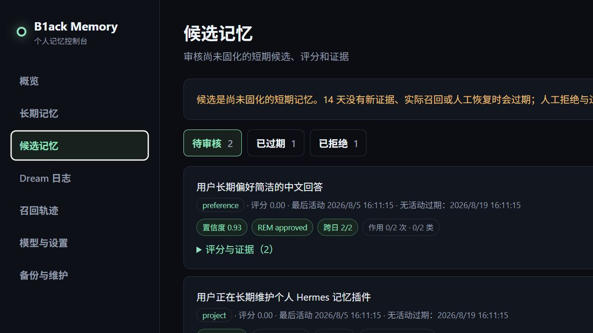
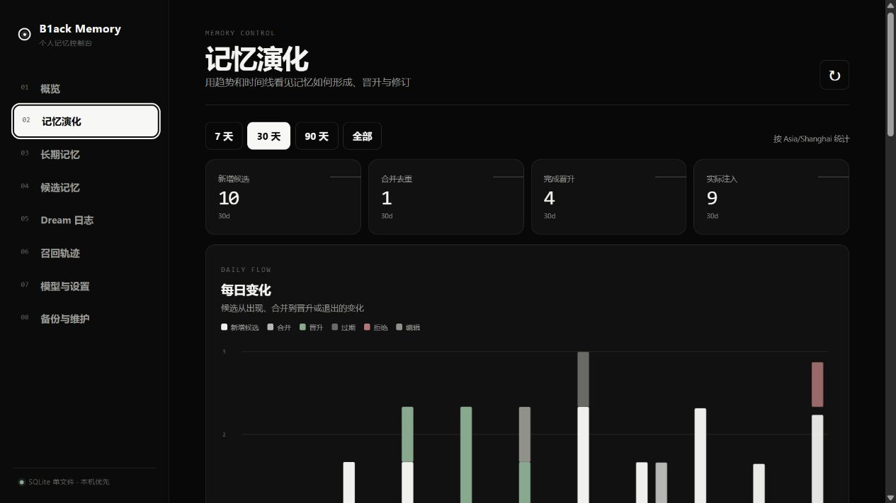
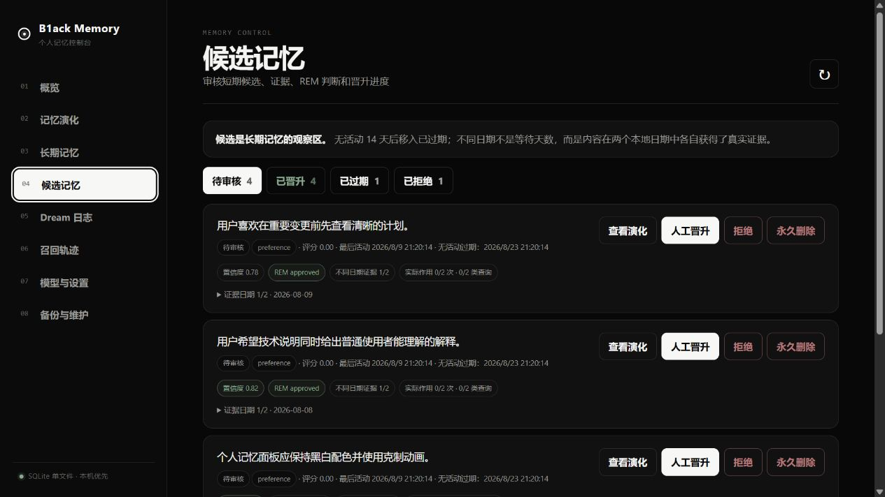

# B1ack Memory v0.3.0

B1ack Memory 是一个面向个人、local-first 的 Hermes Memory Provider。它把 SQLite 作为唯一事实源，以全文检索为默认召回方式，并用 Light → REM → Deep 三阶段 Dream 流程保守地整理长期记忆。项目刻意不引入 ORM、外部向量库、Node 构建链或常驻数据库服务，方便一个人阅读、修改和维护。

[更新日志](CHANGELOG.md) · [最新版本](https://github.com/B1ackHand666/B1ack-Memory/releases/latest)

## 能做什么

- 在 Hermes 对话前召回相关的长期记忆和明确标记为“未验证”的候选记忆。
- 自动捕获主 Agent 会话；Light 严格提取长期信息，REM 去重、过滤和检查冲突，Deep 通过双通道固化高质量内容。
- 使用 DeepSeek、OpenAI、Ollama、LM Studio 等 OpenAI-compatible Chat Completions API。
- SQLite FTS5 开箱即用；embeddings 是可选增强，失败时自动退回全文检索。
- WebUI 查看、编辑、回收、永久删除记忆，管理待审核/已晋升/已过期/已拒绝候选，追踪召回并完成设置、备份和维护。
- “记忆演化”用每日变化、状态分布、晋升通道和单条时间线展示证据如何经过 REM、Deep 成为长期记忆。
- 自动生成可读的 `MEMORY.md` 和 `DREAMS.md` 镜像；请通过 WebUI 或 CLI 修改，镜像会被重新生成。

## WebUI 预览








## 安装到 Hermes

要求 Hermes Agent 0.20.0+、Python 3.11+。推荐使用 Hermes 自带的插件安装器：

```bash
hermes plugins install B1ackHand666/B1ack-Memory --enable
hermes memory setup
hermes memory status
hermes b1ack-memory status
```

在 `hermes memory setup` 中选择 `b1ack-memory`。如果 Hermes Gateway 正在运行，安装后执行 `hermes gateway restart`。以后升级已安装插件时运行 `hermes plugins update b1ack-memory`；如果该目录不是由 Git 安装的，可改用安装命令并添加 `--force`。数据保存在插件目录之外，不会随插件升级被覆盖。

从 v0.2.x 升级到 v0.3.0 时数据库会自动迁移到 schema v4，并为已有候选、证据、晋升、长期记忆与修订记录建立“历史回填”事件。无法准确还原的旧晋升原因会明确显示为“历史未知”，不会伪造证据。迁移无需手工重建数据库，升级前仍建议在 WebUI 创建一次手动备份。

Hermes Dashboard 已启用时，运行 `hermes dashboard --no-open`，面板中会出现 B1ack Memory 标签。也可启动更轻量的独立 WebUI：

```bash
hermes b1ack-memory ui --host 127.0.0.1 --port 7788 --no-open
```

服务器上建议保持 loopback 监听，再通过 SSH 端口转发访问；不要把 WebUI 直接暴露到公网。独立页面地址是 `http://127.0.0.1:7788/api/ui/`。

开发时可在项目目录运行 `python -m pip install -e ".[web]"`，然后使用独立命令 `b1ack-memory`。仅用 pip 安装 wheel 不会让 Hermes 0.20.x 自动发现 Memory Provider，生产安装请使用上面的 `hermes plugins install`。

## 首次设置

1. 运行 `hermes b1ack-memory ui`，打开“模型与设置”。
2. 填写 OpenAI-compatible Base URL、模型名和 API Key，点击“测试连接”。
3. 在“时间与日期”中采用浏览器检测的 IANA 时区，再调整每日 Dream 时间。未配置时使用服务器系统时区。
4. 向量检索默认关闭，不影响中文和英文全文检索；在“备份与维护”创建第一次备份。

DeepSeek 示例：Base URL 使用 `https://api.deepseek.com`，模型名填写账户当前可用的模型 ID。其他服务只要支持 `/chat/completions` 即可。Embeddings 可单独使用另一兼容服务和密钥。

对 DeepSeek V4，插件会默认关闭 thinking 模式：Dream 提取是结构化批处理，这样延迟和费用更低；如需复杂推理，可改用其他兼容端点或在 `b1ack_memory/llm.py` 调整请求策略。

## 数据与安全

默认数据目录是 `~/.hermes/b1ack-memory`，同一操作系统用户下的所有 Hermes profile 共用；可用 `B1ACK_MEMORY_HOME` 显式覆盖。主要文件：

- `memory.db`：记忆、候选、证据、Dream 运行、演化事件、模型调用和召回轨迹。
- `secrets.json`：API Key；Linux/macOS 写入权限为 `0600`，WebUI 永不回显明文。
- `MEMORY.md`、`DREAMS.md`：由数据库生成的可读镜像。
- `backups/`：受保留数量限制的 SQLite 在线备份。
- `b1ack-memory.log`：轮转日志，单文件 1 MB，保留 5 份。

WebUI 和 API 只允许 loopback 客户端；所有写操作还要求进程启动时生成的临时令牌。会话入库前执行常见密钥模式脱敏；疑似敏感个人信息不会自动晋升。记忆文本仍属于私密数据，请保护操作系统账户和备份目录。

“回收”可恢复；长期记忆必须先进入回收站才能永久删除。手动永久删除长期记忆或候选时，会删除关联证据、原始会话、召回轨迹、向量、Dream 与模型调用，清理旧托管备份、截断 WAL、压缩数据库，再生成一份干净备份，因此无法从插件托管备份中恢复。

自动候选清理只删除在线数据库中的候选及其派生索引，不主动清空旧备份；旧副本会按照“保留备份数”自然轮换。这既保持数据库整洁，也保留日常故障恢复能力。

## Dream 晋升规则

Light 仅提取稳定偏好或事实、长期目标/项目、重要决定、关系、明确纠正和重复流程。寒暄、临时进度、一次性任务、引用材料、系统/工具输出和未经确认的助手推测会被排除。模型置信度低于 0.75 的内容不会入库，每次 Dream 最多新增 8 条候选。

REM 会在同一次已有模型调用中逐条给出耐久、同义候选、已有记忆、近期拒绝、噪声、冲突或暂缓判断。它会看到相关候选及其证据日期；确认同义后合并证据和召回记录，改善中文不同措辞无法累计证据的问题，不增加额外模型调用。噪声进入已过期区。自动晋升要求模型置信度至少 0.80、最新 REM 已批准、无敏感或冲突，并满足以下任一通道：

- 不同日期证据通道：至少在记忆时区的 2 个不同日期获得真实会话证据。单纯存放两天或运行两次 Dream 不算证据。
- 实际作用通道：至少实际注入回答 2 次，且来自至少 2 种不同查询。

综合评分只负责给合格候选排序，不再是额外硬门槛。自动晋升每天最多 3 条，人工晋升不占用该额度。Deep 只能整理已经合格的候选 ID，不能绕过候选区直接创造长期记忆；候选原文、REM 判断、晋升通道和 Deep 整理结果都会保留在演化时间线中。

## 记忆演化与时区

“记忆演化”默认显示最近 30 天，可切换 7 天、90 天或全部历史。每日变化图统计候选新增、合并、晋升、过期、拒绝和长期记忆编辑；状态分布和晋升通道帮助判断候选是否堆积、自动晋升是否正常。最近变化列表以及长期记忆/候选卡片上的“查看演化”，会打开“证据 → 候选 → REM → 晋升 → Deep 整理 → 后续修订”的单条时间线。虚线或“历史回填”表示升级前只能部分还原的历史。

证据日期、每日 Dream、每日晋升上限和图表日期统一使用“模型与设置 → 时间与日期”中的记忆时区。建议在浏览器首次打开时点击“采用”检测结果。修改时区会安全重算所有候选的不同日期证据数量；不会修改原始时间戳。

## 候选生命周期

- 获得新证据、实际注入回答或人工恢复都会更新候选的最后活动时间。
- 默认连续 14 天无活动后进入“已过期”，停止召回和自动晋升。
- 已过期候选再次获得证据会自动恢复；人工拒绝的同一内容在保留期内不会重新出现。
- 已过期和已拒绝候选默认保留 30 天，之后由每日维护自动清理。
- 上限和保留天数都可以在 WebUI 调整；复杂晋升阈值使用内置推荐值，无需个人维护。

模型不可用时，原始会话会保留并在 Dream 日志中记录失败；全文召回、手工记忆和 WebUI 维护仍然可用。

`dream --dry-run` 和 WebUI 的“试运行（不写入）”会在临时数据库副本上完成全部分析并产生真实模型费用，但不会消费会话、写入候选、运行记录或模型调用。

## 常用 CLI

```bash
b1ack-memory status
b1ack-memory search "我的编辑器偏好" --limit 5
b1ack-memory remember "我偏好简洁的中文回答" --kind preference
b1ack-memory dream --dry-run
b1ack-memory backup
b1ack-memory maintenance --cleanup --vacuum
```

## 开发与验证

```bash
python -m unittest discover -s tests -v
python -m compileall -q b1ack_memory
```

数据库结构集中在 `b1ack_memory/db.py`，Dream 策略在 `b1ack_memory/dream.py`，Hermes 适配层在 `b1ack_memory/provider.py`，页面没有前端构建步骤，直接编辑 `b1ack_memory/static/` 即可。
