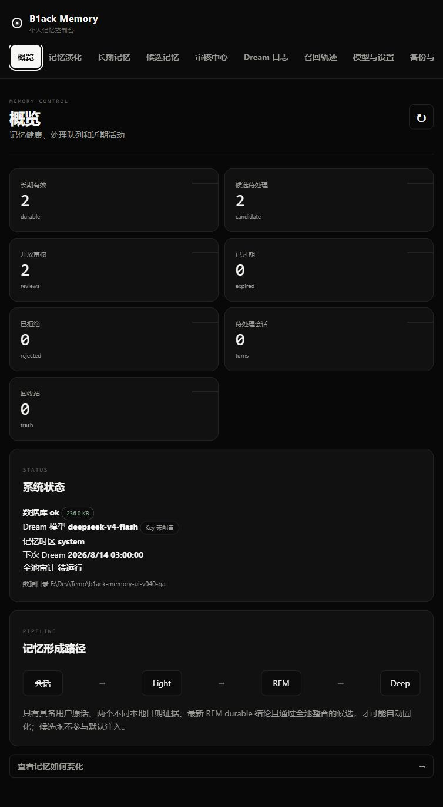
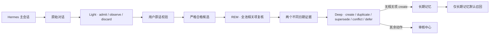
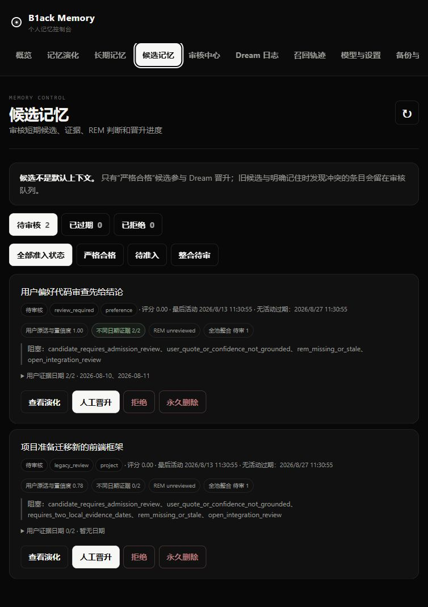
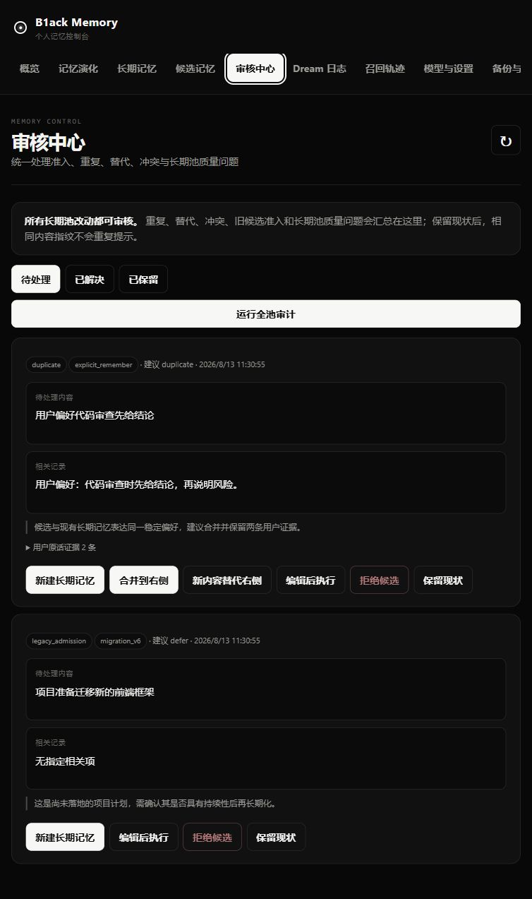

<div align="center">
  <h1>B1ack Memory</h1>
  <p><strong>让 Hermes 拥有可观察、可修正、真正属于你的长期记忆。</strong></p>
  <p>个人级 · local-first · 白盒化 Dream · 低成本模型兼容 · 单人可维护</p>

  <p>
    <a href="https://github.com/B1ackHand666/B1ack-Memory/releases/latest"></a>
    
    
    
  </p>

  <p>
    <a href="#快速开始">快速开始</a> ·
    <a href="#记忆如何形成">工作方式</a> ·
    <a href="#记忆演化">记忆演化</a> ·
    <a href="#数据与安全">数据安全</a> ·
    <a href="CHANGELOG.md">更新日志</a>
  </p>
</div>

> **v0.5.1：Dashboard 加载修复。** Hermes Dashboard 现在通过受宿主鉴权保护的外部资源加载 WebUI，避免安全策略拦截内联脚本后页面永久停留在骨架屏。项目工作记忆、摘要和检索资产仍全部由 SQLite 派生并可重建。

## v0.5.0 的五个工作区

- **概览**：长期记忆、活跃项目、工作项、开放审核、存储和备份六个核心状态；只有真正阻塞用户的事项进入“需要处理”。
- **记忆库**：长期记忆、工作记忆、主题与实体、历史版本统一搜索，详情抽屉集中显示证据、时间有效性、项目归属和版本。
- **项目**：项目摘要、当前状态、已确认决定和开放问题组成工作台，提供上下文预览、暂停注入、归档和摘要重建。
- **审核**：冲突、替代和危险操作进入“需要决定”；项目归属、重复、过期项和摘要刷新进入“整理建议”。
- **系统**：Dream 与审计、召回轨迹、模型、存储与备份和高级设置采用渐进披露，不增加一级导航。

### 从 v0.4.0 升级

v6 数据库会先创建 `backups/*-pre-schema-v7.db`，完整性校验后再向前迁移至 schema v7。已有长期记忆保持全局 `current`，不会自动归属或改写；全部旧 `observe` 日志都会保留，生命周期内的转换为 `suggested`，已过期的转换为 `expired` 历史。开发期已生成的临时 schema v7 数据库会按列检测原地补齐，不需要降级或重建。旧版无法唯一关联长期记忆的 promoted candidate 会转为 `legacy_review` 并保留证据、模型调用和召回数据，不再删除。首次启动会生成 `vault/profile.md`、项目/主题页与索引 manifest，这些文件都能从 `memory.db` 一键重建。

备份现在是带 manifest 和 SHA-256 校验的 ZIP 整包，默认不包含 API Key。恢复必须先通过归档、SQLite 和 schema 校验并展示差异，执行前还会自动备份当前状态；执行时先在同目录 `.restore.tmp` 完成迁移和 fsync，再原子替换事实库。高于当前实现的 schema 会被拒绝，仍有迁移路径的旧 schema 可直接恢复。

<p align="center">
  
</p>
<p align="center"><sub>每一条长期记忆从哪里来、为什么晋升、后来如何变化，都可以被看见。</sub></p>

## 为什么选择 B1ack Memory

| 本地优先 | 记忆白盒化 | 低成本模型 |
| :--- | :--- | :--- |
| SQLite 单文件是唯一事实源，不需要外部数据库或云端记忆服务。 | 从原始证据、候选、REM 判断到 Deep 整理，完整展示记忆演化路径。 | 支持 DeepSeek、OpenAI、Ollama、LM Studio 等 OpenAI-compatible 服务。 |
| **自动治理** | **隐私可控** | **单人可维护** |
| 原话准入、全池整合、统一审核和周期审计，阻止噪声、重复与冲突进入长期池。 | 支持回收、恢复和关联数据硬删除；密钥不在 WebUI 中回显。 | 无 ORM、无 Node 构建链、无新增常驻服务，主要维护都能在 WebUI 完成。 |

B1ack Memory 在 Hermes 回答前只召回相关的有效长期记忆。候选仅在显式搜索中以 `UNVERIFIED` 标记返回，不参与默认注入，也不会因搜索或历史召回次数获得晋升资格。全文检索开箱即用；embeddings 只是可选增强，即使向量服务不可用也能继续工作。

## 快速开始

要求 Hermes Agent 0.20.0+、Python 3.11+。生产环境请使用 Hermes 插件安装器，单独安装 wheel 不会让 Hermes 0.20.x 自动发现 Memory Provider。

### 1 · 安装插件

```bash
hermes plugins install B1ackHand666/B1ack-Memory --enable
```

### 2 · 选择记忆 Provider

```bash
hermes memory setup
```

在交互界面中选择 `b1ack-memory`。

### 3 · 重启 Hermes

```bash
hermes gateway restart
```

Dashboard 已启用时，重新启动 Dashboard 进程以加载新版插件页面：

```bash
hermes dashboard --no-open
```

### 4 · 验证状态

```bash
hermes memory status
hermes b1ack-memory status
```

### 升级现有安装

升级前先创建一份记忆备份，再更新插件并重启网关：

```bash
hermes b1ack-memory backup
hermes plugins update b1ack-memory
hermes gateway restart
```

如果插件目录不是通过 Git 安装的，使用强制安装更新：

```bash
hermes plugins install B1ackHand666/B1ack-Memory --enable --force
hermes gateway restart
```

升级到 v0.4.0 时，schema v5 数据库会先自动创建 `pre-schema-v6` 在线备份，再迁移至 schema v6。现有长期记忆保持原样；旧的待审核候选会标记为 `legacy_review` 并停止自动晋升，首次全池审计只生成准入、重复、冲突或质量建议，不会自动清理或改写已有数据。

## 打开个人记忆控制台

Hermes Dashboard 中会出现 **B1ack Memory** 标签。也可以启动更轻量的独立 WebUI：

```bash
hermes b1ack-memory ui --host 127.0.0.1 --port 7788 --no-open
```

独立页面地址为 `http://127.0.0.1:7788/api/ui/`。服务器上建议保持 loopback 监听，再通过 SSH 端口转发访问，不要直接暴露到公网。

首次打开后：

1. 在“模型与设置”中填写兼容地址、模型名和 API Key，并测试连接。
2. 在“时间与日期”中一键采用浏览器检测的 IANA 时区，再设置每日 Dream 时间。
3. 保持 embeddings 关闭即可使用中英文全文检索；需要时再单独启用向量增强。
4. 在“备份与维护”创建第一份手动备份。

## 记忆如何形成



- **Light** 结构化输出 `admit / observe / discard`。只有稳定偏好、个人事实、长期约束、持续项目锚点、重复流程、关系、明确纠正和持续决定允许准入。
- **Grounding** 每个 admit 必须引用同一用户消息中的原话；助手文本只是不可信上下文，伪造、低置信度或错误类型不会进入候选池。
- **REM** 按最久未审顺序处理未审核或证据变化后的候选，并从完整 FTS 池检索相关候选与长期记忆，避免固定前 100 条和高分候选饥饿问题。
- **Deep** 对每条合格候选固定输出 `create / duplicate / supersede / conflict / defer`。只有全池无相关项的 `create` 可以自动新增，其余全部进入审核中心。
- **Recall** 默认预取在检索层强制排除候选；显式搜索候选不会更新活动时间、召回计数或晋升资格。

## 记忆演化

“记忆演化”页面提供最近 7 天、30 天、90 天或全部历史的变化视图：

- 每日候选新增、合并、晋升、过期、拒绝和长期记忆编辑。
- 待审核、长期有效、已过期和已拒绝状态分布；已晋升不再作为需要维护的候选存量展示。
- 不同日期证据、人工晋升和审核后整合来源；旧版“实际作用”只作为历史血缘保留，不再是晋升通道。
- 单条记忆的“证据 → 候选 → REM → 晋升 → Deep 整理 → 后续修订”时间线。
- “最近变化”固定显示所选范围内最新 20 条；完整历史仍保留在每条长期记忆的演化时间线中。

### 候选证据与晋升白盒

<p align="center">
  
</p>
<p align="center"><sub>用户原话、不同日期证据、REM 状态、全池整合状态和明确阻塞原因集中展示。</sub></p>

<p align="center">
  
</p>
<p align="center"><sub>准入、重复、替代、冲突和长期池质量问题统一进入可解释、可抑制重复提示的审核流程。</sub></p>

候选页面区分“严格合格、待准入、整合待审”，并继续管理已过期与已拒绝记录。统一“审核中心”汇总候选准入、候选与长期记忆的重复/替代/冲突提案，以及长期池的重复、冲突、临时、证据不足和可能过时问题。

审核中心支持新建长期记忆、合并到 canonical 记忆、用新记忆替代旧记忆、保留两者、编辑后执行、拒绝或过期候选，以及保留、编辑或回收低质量长期记忆。`keep_both`/保留现状会记录当前内容指纹，相关内容不变时不会重复提示。每次新增、编辑、晋升和恢复会运行增量审计；每日 Dream 会在距离上次成功全池审计满 7 天时触发分批扫描，也可以在 WebUI 手动运行。

<details>
<summary><strong>Dream 与自动晋升规则</strong></summary>

Light 会把项目进度、迁移记录、完成操作、待落实方案和临时状态记录为 `observe`，把寒暄、一次性任务、引用材料、工具输出和助手推测记录为 `discard`；两者都不创建候选。自动准入置信度至少为 `0.85`，并要求可在脱敏后的用户消息中验证原话。每次 Dream 最多新增 8 条候选。

自动晋升同时要求：

- 在记忆时区的至少 2 个不同日期获得可验证的用户原话证据；单纯存放两天或运行两次 Dream 不算证据。
- 最新 REM 结论为 durable，且审核时间不早于最后一条新证据。
- 候选非敏感、没有开放冲突或整合提案，并通过 Deep 全池整合。
- 当日自动晋升仍有额度；默认每天最多 3 条。

综合评分只负责为合格候选排序，召回次数不参与评分。一个 Deep 批次会先完整分析并校验全部候选，再在单一事务中提交自动新增和审核提案；模型不可用、输出缺项或引用未知 ID 时不会产生部分写入。

</details>

<details>
<summary><strong>候选生命周期</strong></summary>

- 只有获得新用户证据或人工恢复会更新候选活动时间；显式搜索和历史注入不会更新。
- 默认连续 14 天无活动后进入“已过期”，停止召回和自动晋升。
- 已过期候选再次获得证据会自动恢复；人工拒绝的同义内容在保留期内受到抑制。
- 已过期和已拒绝候选默认再保留 30 天，之后由每日维护自动清理。
- 上限和保留天数可在 WebUI 调整；复杂晋升阈值采用内置推荐值。

模型不可用时，原始会话仍会保留并在 Dream 日志中记录失败；全文召回和 WebUI 维护继续可用。明确“记住”在全池无相关项时仍可立即写入；发现潜在重复或冲突时会保留候选并创建带阻塞原因的审核项，不会绕过整合检查。

</details>

## 数据与安全

默认数据目录是 `~/.hermes/b1ack-memory`，同一操作系统用户下的 Hermes profiles 共用；也可以通过 `B1ACK_MEMORY_HOME` 显式覆盖。

| 文件 | 用途 |
| :--- | :--- |
| `memory.db` | 记忆、候选、用户原话证据、准入决策、审核项、审计运行、Dream、演化事件、模型调用和召回轨迹的唯一事实源。 |
| `secrets.json` | API Key；Linux/macOS 权限为 `0600`，WebUI 永不回显明文。 |
| `MEMORY.md` / `DREAMS.md` | 自动生成的可读镜像，不应直接编辑。 |
| `vault/` | 自动生成的用户档案、项目页和主题页；带来源 revision 与校验和，可一键重建。 |
| `indexes/` | 可选语义索引和派生检索资产；删除后可从数据库完整重建。 |
| `backups/` | 带 manifest、schema 版本和 SHA-256 校验的 ZIP 整包备份；默认排除 API Key。 |
| `b1ack-memory.log` | 轮转日志，单文件 1 MB，保留 5 份。 |

独立 WebUI 和 API 同时校验 loopback 客户端与合法 `Host`：打开 `/ui/` 会建立 HttpOnly、SameSite=Strict 的进程会话，CLI 也会在终端显示可供脚本使用的临时 Bearer token。所有数据读取都需要其中一种凭据，基于会话的写入还必须通过同源 Origin 校验；`/bootstrap` 不返回令牌。Hermes Dashboard 路由则复用宿主 session/cookie 鉴权。会话入库前会执行常见密钥模式脱敏，疑似敏感内容不会自动晋升。

Linux/macOS 上，数据根目录、`backups/`、`vault/` 和 `indexes/` 使用 `0700`，数据库、WAL/SHM、Markdown、日志、投影和 ZIP 使用 `0600`。Windows 的权限由 ACL 管理，系统页会逐路径显示平台状态和修复建议。连续三次提取失败的 raw turn 会进入隔离区，不再自动调用模型；可在“系统 → 存储与备份”中核对错误并单条重试。

<details>
<summary><strong>回收、永久删除与备份边界</strong></summary>

长期记忆可以先移入回收站再恢复；恢复也会经过统一整合关口。回收期间仍保留候选来源和完整演化记录。永久删除前必须先回收；永久删除会同步清除已晋升候选、关联证据、准入日志、审核项、原始会话、召回轨迹、向量、Dream、模型调用和演化事件，同时删除旧托管备份、截断 WAL、压缩数据库，并生成一份删除后的干净备份。

自动候选清理只删除在线数据库中的候选及派生索引，不主动清空旧备份；旧副本按照“保留备份数”自然轮换。记忆和备份仍属于私密数据，请保护服务器账户与数据目录。

</details>

<details>
<summary><strong>模型兼容与时区说明</strong></summary>

Dream 模型支持 OpenAI-compatible Chat Completions API。DeepSeek 官方服务示例：

- Base URL：`https://api.deepseek.com`
- 模型名：填写账户当前可用的模型 ID

Embeddings 可以使用另一套兼容服务和独立密钥，也可以始终关闭。对 DeepSeek V4，插件默认关闭 thinking 模式，以降低结构化 Dream 批处理的延迟和费用。

证据日期、每日 Dream、每日晋升额度和图表日期统一使用“模型与设置 → 时间与日期”中的记忆时区。修改时区会重新计算不同日期证据数量，但不会修改原始时间戳。

</details>

<details>
<summary><strong>常用 CLI</strong></summary>

```bash
b1ack-memory status
b1ack-memory search "我的编辑器偏好" --limit 5
b1ack-memory remember "我偏好简洁的中文回答" --kind preference
b1ack-memory dream --dry-run
b1ack-memory backup
b1ack-memory maintenance --cleanup --vacuum
```

`dream --dry-run` 会在临时数据库副本上完成完整分析并产生真实模型费用，但不会消费会话或写入候选、Dream 记录和模型调用。

</details>

## 设计边界

> 小、透明、可修改，比堆叠基础设施更重要。

- SQLite 是唯一事实源，全文检索无需外部服务即可工作。
- embeddings 只能作为可选增强，失败时自动回退。
- 不引入 ORM、外部数据库、Node 构建链或新的常驻服务。
- WebUI 覆盖日常配置、审核、删除、备份和维护。
- `MEMORY.md` 与 `DREAMS.md` 是生成镜像，请通过 WebUI、CLI 或 Provider 修改数据。

## 开发与验证

```bash
python -m pip install -e ".[web]"
python -m unittest discover -s tests -v
python -m compileall -q b1ack_memory
python -m build
```

核心实现集中在 `b1ack_memory/db.py`、`b1ack_memory/dream.py` 和 `b1ack_memory/provider.py`；WebUI 位于 `b1ack_memory/static/`，无需前端构建步骤。

<div align="center">
  <p><strong>Your memory. Your machine. Your rules.</strong></p>
  <p><a href="https://github.com/B1ackHand666/B1ack-Memory/releases/latest">下载最新版本</a> · <a href="CHANGELOG.md">查看更新日志</a></p>
</div>
