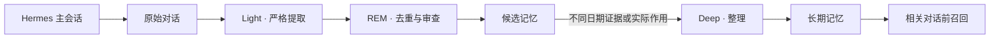

<div align="center">
  <h1>B1ack Memory</h1>
  <p><strong>让 Hermes 拥有可观察、可修正、真正属于你的长期记忆。</strong></p>
  <p>个人级 · local-first · 白盒化 Dream · 低成本模型兼容 · 单人可维护</p>

  <p>
    <a href="https://github.com/B1ackHand666/B1ack-Memory/releases/latest"></a>
    
    
    
  </p>

  <p>
    <a href="#快速开始">快速开始</a> ·
    <a href="#记忆如何形成">工作方式</a> ·
    <a href="#记忆演化">记忆演化</a> ·
    <a href="#数据与安全">数据安全</a> ·
    <a href="CHANGELOG.md">更新日志</a>
  </p>
</div>

<p align="center">
  
</p>
<p align="center"><sub>每一条长期记忆从哪里来、为什么晋升、后来如何变化，都可以被看见。</sub></p>

## 为什么选择 B1ack Memory

| 本地优先 | 记忆白盒化 | 低成本模型 |
| :--- | :--- | :--- |
| SQLite 单文件是唯一事实源，不需要外部数据库或云端记忆服务。 | 从原始证据、候选、REM 判断到 Deep 整理，完整展示记忆演化路径。 | 支持 DeepSeek、OpenAI、Ollama、LM Studio 等 OpenAI-compatible 服务。 |
| **自动治理** | **隐私可控** | **单人可维护** |
| 严格提取、同义合并、过期清理和双通道晋升，减少候选堆积与噪声。 | 支持回收、恢复和关联数据硬删除；密钥不在 WebUI 中回显。 | 无 ORM、无 Node 构建链、无新增常驻服务，主要维护都能在 WebUI 完成。 |

B1ack Memory 会在 Hermes 回答前召回相关长期记忆和明确标记为“未验证”的候选记忆。全文检索开箱即用；embeddings 只是可选增强，即使向量服务不可用也能继续工作。

## 快速开始

要求 Hermes Agent 0.20.0+、Python 3.11+。生产环境请使用 Hermes 插件安装器，单独安装 wheel 不会让 Hermes 0.20.x 自动发现 Memory Provider。

### 1 · 安装插件

```bash
hermes plugins install B1ackHand666/B1ack-Memory --enable
```

### 2 · 选择记忆 Provider

```bash
hermes memory setup
```

在交互界面中选择 `b1ack-memory`。

### 3 · 重启 Hermes

```bash
hermes gateway restart
```

Dashboard 已启用时，重新启动 Dashboard 进程以加载新版插件页面：

```bash
hermes dashboard --no-open
```

### 4 · 验证状态

```bash
hermes memory status
hermes b1ack-memory status
```

### 升级现有安装

升级前先创建一份记忆备份，再更新插件并重启网关：

```bash
hermes b1ack-memory backup
hermes plugins update b1ack-memory
hermes gateway restart
```

如果插件目录不是通过 Git 安装的，使用强制安装更新：

```bash
hermes plugins install B1ackHand666/B1ack-Memory --enable --force
hermes gateway restart
```

从 v0.2.x 升级到 v0.3.0 时，数据库会自动迁移至 schema v4。已有记忆不会要求重新导入；无法精确还原的旧晋升原因会明确显示为“历史未知”，不会伪造证据。

## 打开个人记忆控制台

Hermes Dashboard 中会出现 **B1ack Memory** 标签。也可以启动更轻量的独立 WebUI：

```bash
hermes b1ack-memory ui --host 127.0.0.1 --port 7788 --no-open
```

独立页面地址为 `http://127.0.0.1:7788/api/ui/`。服务器上建议保持 loopback 监听，再通过 SSH 端口转发访问，不要直接暴露到公网。

首次打开后：

1. 在“模型与设置”中填写兼容地址、模型名和 API Key，并测试连接。
2. 在“时间与日期”中一键采用浏览器检测的 IANA 时区，再设置每日 Dream 时间。
3. 保持 embeddings 关闭即可使用中英文全文检索；需要时再单独启用向量增强。
4. 在“备份与维护”创建第一份手动备份。

## 记忆如何形成



- **Light** 只提取稳定偏好、长期目标、重要决定、关系、纠正和重复流程。
- **REM** 判断内容是否耐久、重复、冲突、被拒绝或只是临时噪声，并合并同义证据。
- **Deep** 只能整理已经满足晋升条件的候选，不能绕过候选区凭空创建长期记忆。
- **Recall** 只注入与当前问题相关的少量记录，不会每次把全部记忆塞入上下文。

## 记忆演化

“记忆演化”页面提供最近 7 天、30 天、90 天或全部历史的变化视图：

- 每日候选新增、合并、晋升、过期、拒绝和长期记忆编辑。
- 待审核、已晋升、长期有效、已过期和已拒绝状态分布。
- 不同日期证据、实际作用、双通道和人工晋升来源。
- 单条记忆的“证据 → 候选 → REM → 晋升 → Deep 整理 → 后续修订”时间线。

### 候选证据与晋升白盒

<p align="center">
  
</p>
<p align="center"><sub>不同日期证据、实际作用、REM 结果、最后活动和清理倒计时集中展示。</sub></p>

<details>
<summary><strong>Dream 与自动晋升规则</strong></summary>

Light 会排除寒暄、临时进度、一次性任务、引用材料、系统或工具输出以及未经确认的助手推测。模型置信度低于 `0.75` 的内容不会入库，每次 Dream 最多新增 8 条候选。

REM 在现有调用中逐条判断耐久、同义候选、已有记忆、近期拒绝、噪声、冲突或暂缓，不增加额外模型调用。自动晋升要求置信度至少 `0.80`、最新 REM 已批准、无敏感或冲突，并满足以下任一通道：

- **不同日期证据**：在记忆时区的至少 2 个不同日期获得真实会话证据。单纯存放两天或运行两次 Dream 不算证据。
- **实际作用**：至少实际注入回答 2 次，并来自至少 2 种不同查询。

综合评分只负责为合格候选排序。自动晋升每天最多 3 条，人工晋升不占用该额度。无效模型 JSON 不会造成部分写入或错误晋升。

</details>

<details>
<summary><strong>候选生命周期</strong></summary>

- 获得新证据、实际注入回答或人工恢复都会更新最后活动时间。
- 默认连续 14 天无活动后进入“已过期”，停止召回和自动晋升。
- 已过期候选再次获得证据会自动恢复；人工拒绝的同义内容在保留期内受到抑制。
- 已过期和已拒绝候选默认再保留 30 天，之后由每日维护自动清理。
- 上限和保留天数可在 WebUI 调整；复杂晋升阈值采用内置推荐值。

模型不可用时，原始会话仍会保留并在 Dream 日志中记录失败；全文召回、人工记忆和 WebUI 维护继续可用。

</details>

## 数据与安全

默认数据目录是 `~/.hermes/b1ack-memory`，同一操作系统用户下的 Hermes profiles 共用；也可以通过 `B1ACK_MEMORY_HOME` 显式覆盖。

| 文件 | 用途 |
| :--- | :--- |
| `memory.db` | 记忆、候选、证据、Dream、演化事件、模型调用和召回轨迹的唯一事实源。 |
| `secrets.json` | API Key；Linux/macOS 权限为 `0600`，WebUI 永不回显明文。 |
| `MEMORY.md` / `DREAMS.md` | 自动生成的可读镜像，不应直接编辑。 |
| `backups/` | 受保留数量限制的 SQLite 在线备份。 |
| `b1ack-memory.log` | 轮转日志，单文件 1 MB，保留 5 份。 |

WebUI 和 API 默认只接受 loopback 客户端；写操作还需要进程启动时生成的临时令牌。会话入库前会执行常见密钥模式脱敏，疑似敏感内容不会自动晋升。

<details>
<summary><strong>回收、永久删除与备份边界</strong></summary>

长期记忆可以先移入回收站再恢复；永久删除前必须先回收。手动永久删除候选或长期记忆时，会清理关联证据、原始会话、召回轨迹、向量、Dream、模型调用和演化事件，同时删除旧托管备份、截断 WAL、压缩数据库，并生成一份删除后的干净备份。

自动候选清理只删除在线数据库中的候选及派生索引，不主动清空旧备份；旧副本按照“保留备份数”自然轮换。记忆和备份仍属于私密数据，请保护服务器账户与数据目录。

</details>

<details>
<summary><strong>模型兼容与时区说明</strong></summary>

Dream 模型支持 OpenAI-compatible Chat Completions API。DeepSeek 官方服务示例：

- Base URL：`https://api.deepseek.com`
- 模型名：填写账户当前可用的模型 ID

Embeddings 可以使用另一套兼容服务和独立密钥，也可以始终关闭。对 DeepSeek V4，插件默认关闭 thinking 模式，以降低结构化 Dream 批处理的延迟和费用。

证据日期、每日 Dream、每日晋升额度和图表日期统一使用“模型与设置 → 时间与日期”中的记忆时区。修改时区会重新计算不同日期证据数量，但不会修改原始时间戳。

</details>

<details>
<summary><strong>常用 CLI</strong></summary>

```bash
b1ack-memory status
b1ack-memory search "我的编辑器偏好" --limit 5
b1ack-memory remember "我偏好简洁的中文回答" --kind preference
b1ack-memory dream --dry-run
b1ack-memory backup
b1ack-memory maintenance --cleanup --vacuum
```

`dream --dry-run` 会在临时数据库副本上完成完整分析并产生真实模型费用，但不会消费会话或写入候选、Dream 记录和模型调用。

</details>

## 设计边界

> 小、透明、可修改，比堆叠基础设施更重要。

- SQLite 是唯一事实源，全文检索无需外部服务即可工作。
- embeddings 只能作为可选增强，失败时自动回退。
- 不引入 ORM、外部数据库、Node 构建链或新的常驻服务。
- WebUI 覆盖日常配置、审核、删除、备份和维护。
- `MEMORY.md` 与 `DREAMS.md` 是生成镜像，请通过 WebUI、CLI 或 Provider 修改数据。

## 开发与验证

```bash
python -m pip install -e ".[web]"
python -m unittest discover -s tests -v
python -m compileall -q b1ack_memory
python -m build
```

核心实现集中在 `b1ack_memory/db.py`、`b1ack_memory/dream.py` 和 `b1ack_memory/provider.py`；WebUI 位于 `b1ack_memory/static/`，无需前端构建步骤。

<div align="center">
  <p><strong>Your memory. Your machine. Your rules.</strong></p>
  <p><a href="https://github.com/B1ackHand666/B1ack-Memory/releases/latest">下载最新版本</a> · <a href="CHANGELOG.md">查看更新日志</a></p>
</div>
