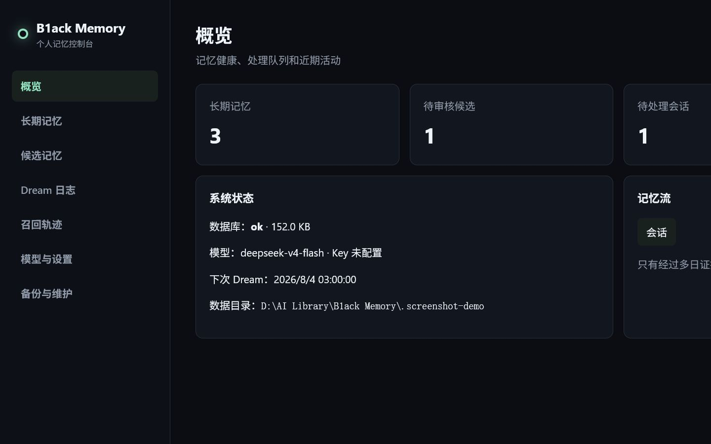
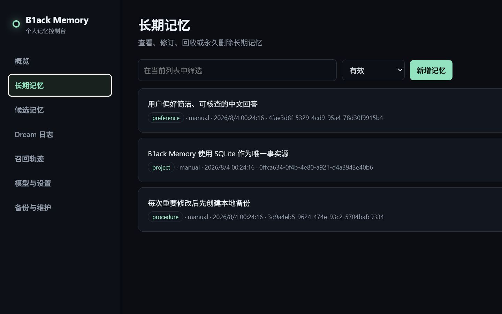

# B1ack Memory v0.1.0

B1ack Memory 是一个面向个人、local-first 的 Hermes Memory Provider。它把 SQLite 作为唯一事实源，以全文检索为默认召回方式，并用 Light → REM → Deep 三阶段 Dream 流程保守地整理长期记忆。项目刻意不引入 ORM、外部向量库、Node 构建链或常驻数据库服务，方便一个人阅读、修改和维护。

## 能做什么

- 在 Hermes 对话前召回相关的长期记忆和明确标记为“未验证”的候选记忆。
- 自动捕获主 Agent 会话；Light 提取候选，REM 汇总和检查冲突，Deep 只晋升证据充分的内容。
- 使用 DeepSeek、OpenAI、Ollama、LM Studio 等 OpenAI-compatible Chat Completions API。
- SQLite FTS5 开箱即用；embeddings 是可选增强，失败时自动退回全文检索。
- WebUI 查看、编辑、回收、永久删除记忆，审核候选，追踪每次召回，配置模型并完成备份维护。
- 自动生成可读的 `MEMORY.md` 和 `DREAMS.md` 镜像；请通过 WebUI 或 CLI 修改，镜像会被重新生成。

## WebUI 预览





## 安装到 Hermes

要求 Hermes Agent 0.18.2+、Python 3.11+。个人安装推荐将本目录复制或链接为 `~/.hermes/plugins/b1ack-memory`，然后在 Hermes 配置中把 memory provider 设为 `b1ack-memory`。也可以通过 wheel/pip entry point 安装；发布包同时携带 provider、CLI、静态页面与 Dashboard 资产。

开发时也可以在本目录运行：

```bash
python -m pip install -e .
b1ack-memory status
b1ack-memory ui
```

若 Hermes 尚未安装 Web Dashboard 依赖，使用 `python -m pip install -e ".[web]"`。独立 WebUI 默认只监听 `http://127.0.0.1:7788/api/ui/`。Dashboard 安装器若检测到 `dashboard/manifest.json`，会复用同一套页面和 API。

## 首次设置

1. 运行 `b1ack-memory ui`，打开“模型与设置”。
2. 填写 OpenAI-compatible Base URL、模型名和 API Key，点击“测试连接”。
3. 根据需要调整每日 Dream 时间。向量检索默认关闭，不影响中文和英文全文检索。
4. 在“备份与维护”创建第一次备份。

DeepSeek 示例：Base URL 使用 `https://api.deepseek.com`，模型名填写账户当前可用的模型 ID。其他服务只要支持 `/chat/completions` 即可。Embeddings 可单独使用另一兼容服务和密钥。

对 DeepSeek V4，插件会默认关闭 thinking 模式：Dream 提取是结构化批处理，这样延迟和费用更低；如需复杂推理，可改用其他兼容端点或在 `b1ack_memory/llm.py` 调整请求策略。

## 数据与安全

默认数据目录是 `~/.hermes/b1ack-memory`，同一操作系统用户下的所有 Hermes profile 共用；可用 `B1ACK_MEMORY_HOME` 显式覆盖。主要文件：

- `memory.db`：记忆、候选、证据、Dream 运行、模型调用和召回轨迹。
- `secrets.json`：API Key；Linux/macOS 写入权限为 `0600`，WebUI 永不回显明文。
- `MEMORY.md`、`DREAMS.md`：由数据库生成的可读镜像。
- `backups/`：受保留数量限制的 SQLite 在线备份。
- `b1ack-memory.log`：轮转日志，单文件 1 MB，保留 5 份。

WebUI 和 API 只允许 loopback 客户端；所有写操作还要求进程启动时生成的临时令牌。会话入库前执行常见密钥模式脱敏；疑似敏感个人信息不会自动晋升。记忆文本仍属于私密数据，请保护操作系统账户和备份目录。

“回收”可恢复；“永久删除”会删除关联候选、证据、原始会话、召回轨迹、向量、Dream 与模型调用，清理旧托管备份、截断 WAL、压缩数据库，再生成一份干净备份，因此无法从插件托管备份中恢复。

## Dream 晋升规则

候选综合考虑召回次数、查询多样性、重复证据天数、近期性与内容完整度。自动晋升同时要求：总分 ≥ 0.85、模型置信度 ≥ 0.80、至少 3 次注入召回、至少 2 种查询、至少跨 2 天证据，并且不得敏感或存在冲突。任一条件不满足都会留在候选区供人工审核。

模型不可用时，原始会话会保留并在 Dream 日志中记录失败；全文召回、手工记忆和 WebUI 维护仍然可用。

`dream --dry-run` 和 WebUI 的“试运行（不写入）”会在临时数据库副本上完成全部分析并产生真实模型费用，但不会消费会话、写入候选、运行记录或模型调用。

## 常用 CLI

```bash
b1ack-memory status
b1ack-memory search "我的编辑器偏好" --limit 5
b1ack-memory remember "我偏好简洁的中文回答" --kind preference
b1ack-memory dream --dry-run
b1ack-memory backup
b1ack-memory maintenance --cleanup --vacuum
```

## 开发与验证

```bash
python -m unittest discover -s tests -v
python -m compileall -q b1ack_memory
```

数据库结构集中在 `b1ack_memory/db.py`，Dream 策略在 `b1ack_memory/dream.py`，Hermes 适配层在 `b1ack_memory/provider.py`，页面没有前端构建步骤，直接编辑 `b1ack_memory/static/` 即可。
